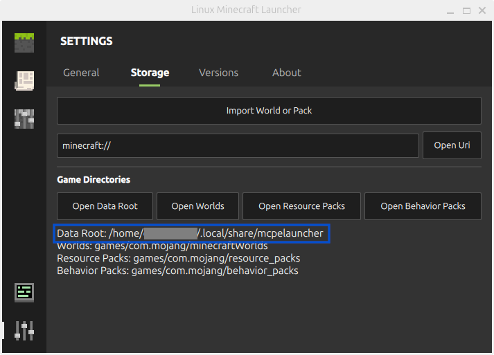
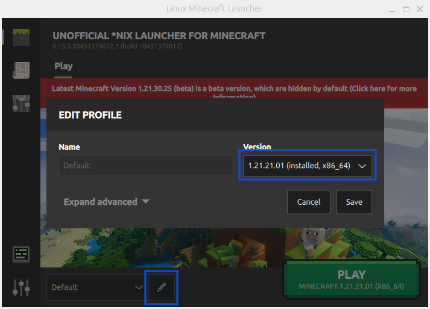

# Frequently Asked Questions

## Do I need to own Minecraft: Pocket Edition to play?

Yes. To download and update a compatible version of the game, the
Google Play account you sign in with needs to own the game on the Play
Store. Then you are able to download and play the latest version and a even few 
previous versions as well, althrough not offically supported by Google Play.

### The launcher **cannot** download the game from:

- The Amazon App store, althrough may or may not work on ARM devices.
  You have to extract the APK from an Amazon device.

### The launcher **cannot** download and **cannot** launch the game from:

- The Apple iOS App store
- The Microsoft Store, previously by redeeming a gift code for
  Minecraft: Windows 10 Edition

  Even if this was possible, it would require a completely different Launcher.
  
### Can I play with an APK?

No, this would allow piracy which is forbidden in this project.

Any attempt to document workarounds or to make it easy to import a paid APK without a valid Google Play game license is undesirable.

Game licenses can be revoked at any point of time by you, Microsoft/Mojang or Google, as it happened to all residents of Russia.

Ignoring this policy may cause suspension including termination of this project like it happended between 2022 - 2023.

_Exception to the rule are Minecraft Trial and Edu where the latter doesn't work at this time._

## Does it work on Windows 7 / 8?

No, due to the amount of work required to get this running on older 
versions of Windows. Play the Windows 10 Edition instead if you can.
Note that you can not play Minecraft in the current version of the 
[Windows Subsystem for Linux(WSL)](https://en.wikipedia.org/wiki/Windows_Subsystem_for_Linux), as
the mouse input is broken due to an [issue](https://github.com/microsoft/wslg/issues/240) with its graphic stack.

## How does it work?

The project runs the native libraries from the Android version directly
on your computer. This is accomplished by fixing the incompatibilities
between the libc used on Android and the one used on desktop Linux or OS
X (Android - Bionic; Linux - glibc). This is a simple compatibility
layer which doesn't impact performance in any significant way; it's
similar to Wine, but much more lightweight and simple. Aditionally, all
Android-specific code has been rewritten to run on Linux (AppPlatform,
Store, Xbox Live, etc.).

## Where are my worlds?

Linux: `~/.local/share/mcpelauncher/games/com.mojang/minecraftWorlds`

Linux (Flatpak):
`~/.var/app/io.mrarm.mcpelauncher/data/mcpelauncher/games/com.mojang/minecraftWorlds`

Mac OS X:
`~/Library/Application Support/mcpelauncher/games/com.mojang/minecraftWorlds`

Each world has its own directory. If you have multiple worlds, you can
identify them by their name in `levelname.txt` found in each world folder.

The `mcpelauncher-server` creates and expects its world files in `world`.

## Can I use resource packs?

Of course, put them into: 
`~/.local/share/mcpelauncher/games/com.mojang/resource_packs`.

(For Flatpak)
`~/.var/app/io.mrarm.mcpelauncher/data/mcpelauncher/games/com.mojang/resource_packs`

For Mac OS X, put them into: 
`~/Library/Application Support/mcpelauncher/games/com.mojang/resource_packs`.

Shaders are also resource packs. (Shaders must be GLSL based and must be
compatible with your graphics drivers)

**Note:** You will probably need to extract `.zip` and `.mcpack` files
into their own subdirectory for them to work properly.

## Can I reenable the native fmod mode?

Yes for Minecraft 1.21.2x and below by extracting the lib/native folder of https://github.com/minecraft-linux/mcpelauncher-linux-bin/tree/1e84fde7d5fb90b913c84b9945700ef6af69df12 or https://github.com/minecraft-linux/mcpelauncher-mac-bin/tree/5189766d94de83a9fa6ea4f8477b1a5faca05bdb directly under [`Data Root`](#where-is-the-data-root-folder)`/lib/native`

## Where is the Data Root folder?

An incomplete list of known values, if your launcher profile has no custom path.

Package Type|Path
---|---
linux|`~/.local/share/mcpelauncher`
linux (flatpak)|`~/.var/app/io.mrarm.mcpelauncher`
macOS|`~/Library/Application Support/mcpelauncher`

## Can I play multiple versions of the game?

Yes, by editing your profile and changing the version in the dropdown menu.

